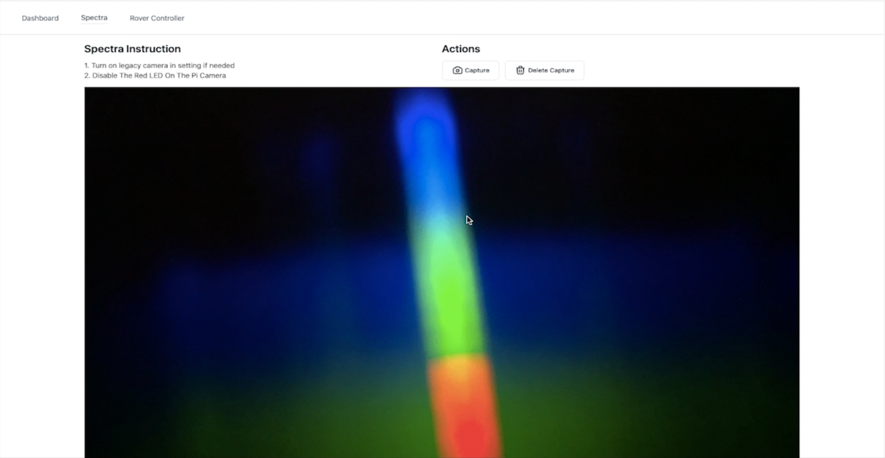
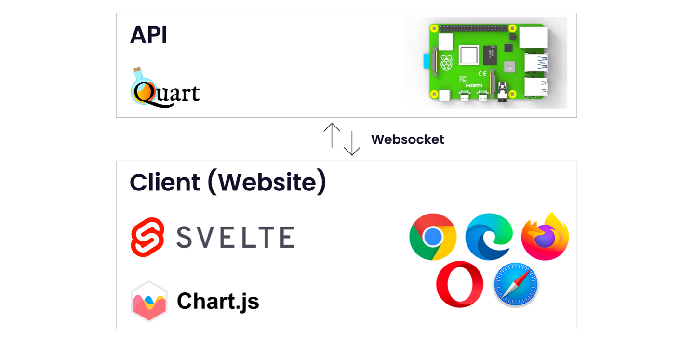

# Weather Station on Rover

## Features

1. Weather Report

2. Rover Controller

3. Taking Photo (or Spectroscope)

## Structure

1. [Diagram](diagram)
2. [API](api/README.md)
3. [Dashboard](dashboard/README.md)

## How to run project

1. [Download and run "api" on the Rasp Pi](api/README.md)
2. [Download and run "dashboard" on either Pi or your computer](dashboard/README.md)
